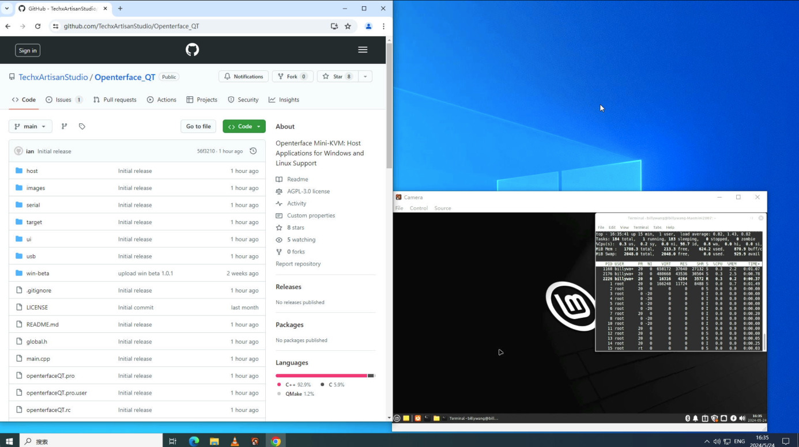

# 🚀 Nuova Versione del Codice per Openterface_QT su GitHub! 💻

🎉 Notizie entusiasmanti! 🎉 Abbiamo appena caricato tutto il nostro nuovo codice per Openterface_QT su GitHub! 🌟 Supporta il nostro Mini-KVM su sistemi Windows e Linux. Immergiti e dai un'occhiata. È ancora in fase di sviluppo iniziale, quindi aspettati qualche stranezza.

Sviluppatori, adoriamo il vostro aiuto! Unitevi a noi per migliorare e affinare il progetto. Buona programmazione! 💻🔧

<!-- more -->
--------

Per ulteriori discussioni, unisciti a [r/Openterface_miniKVM](https://www.reddit.com/r/Openterface_miniKVM/) su Reddit. Restate sintonizzati!