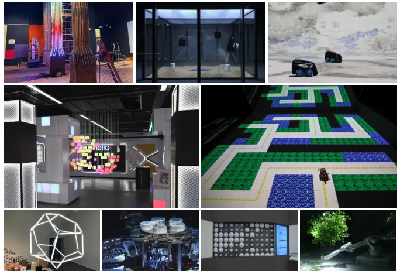
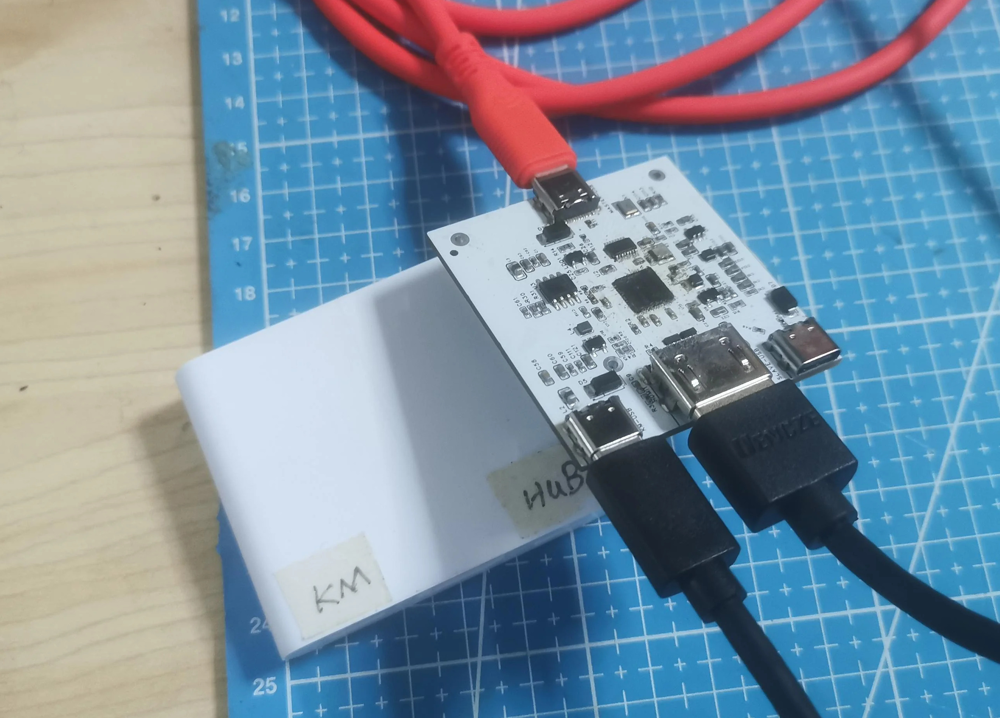

# Conversazione casuale con David Groom di MAKE: Magazine: La storia del Mini-KVM Openterface 🎙️

Ciao a tutti!

Abbiamo appena concluso un fantastico [YouTube livestream](https://www.youtube.com/live/lwitzvmxsgc?si=s9a1t5_Sce5v22e1) con David Groom di MAKE: Magazine! Durante la sessione, abbiamo approfondito la storia di Openterface Mini-KVM, un'innovativa soluzione hardware open-source progettata per controllare senza sforzo i dispositivi headless e i computer single-board come Raspberry Pis utilizzando solo il vostro laptop. Per maggiori dettagli è possibile consultare il livestream su YouTube o semplicemente leggere la storia qui sotto.

<!-- more -->

## La nascita di un'idea

Il viaggio del Mini-KVM è iniziato nella vivace città di Guangzhou, in Cina, all'interno del nostro studio TechxArtisan. Negli ultimi cinque anni, siamo stati profondamente coinvolti in numerosi progetti di tech art per artisti locali e internazionali. Il nostro lavoro comprende la costruzione di installazioni luminose interattive con rilevamento dell'intelligenza artificiale, bracci robotici per spettacoli teatrali, mini auto a guida autonoma che risolvono labirinti casuali e persino un cane robot progettato per esplorare terre inesplorate come deserti e foreste.

### Un mal di testa comune
Una sfida ricorrente nel nostro lavoro è stata la gestione di una pletora di computer senza testa, come Raspberry Pis e Jetson Nano, privi di monitor, tastiere o connettività di rete. Questo ha portato spesso a ricerche frenetiche di monitor e tastiere di ricambio per risolvere i problemi e accedere a questi dispositivi in condizioni difficili.

### Soluzioni di fortuna
Inizialmente, abbiamo fatto ricorso a soluzioni di fortuna con monitor portatili alimentati da batterie e mini-tastiere wireless con touchpad. Tuttavia, queste soluzioni venivano spesso dimenticate o smarrite, e ciò ha reso necessaria una soluzione hardware dedicata che potesse sfruttare i computer portatili che portavamo sempre con noi per la codifica e la configurazione.

*Questi due gadget devono essere portati con sé per i progetti in loco.

### Il primo prototipo
Il nostro primo prototipo fai-da-te era una combinazione semplice ma efficace di una scheda di acquisizione per recuperare il video dal dispositivo senza testa e di un simulatore di tastiera/mouse USB, il tutto integrato in un unico cavo USB collegato ai nostri computer portatili.

*Una delle prime versioni della scheda mini-KVM*.

Nel novembre 2023 abbiamo esposto i nostri progetti artistici tecnologici alla Shenzhen Maker Faire, con l'intenzione di mostrare il prototipo del mini-KVM a David. Tuttavia, eravamo così eccitati per i regali di David che lo abbiamo dimenticato!

*Gli adesivi e le cartoline di MAKE: Magazine sono davvero fantastici!

## Feedback della comunità e sviluppo
Dopo aver condiviso il nostro prototipo su Reddit, abbiamo ricevuto un prezioso feedback da [la comunità](http://openterface.com/community/#community-contributors), che ci ha incoraggiato a perfezionare e sviluppare la nostra soluzione in un prodotto raffinato. Il supporto della comunità è stato fondamentale per trasformare il nostro dispositivo di fortuna in uno strumento elegante ed efficiente per i laboratori domestici, i sysadmin, gli appassionati di tecnologia e tutti coloro che lavorano con i computer senza testa.

*Ha ricevuto un'enorme quantità di feedback da parte degli homelabber*.

## Superare i dubbi
Nonostante i dubbi iniziali sulla possibilità di competere con soluzioni simili già esistenti, la risposta positiva e i suggerimenti costruttivi delle comunità online hanno contribuito a chiarire i potenziali casi d'uso e a rafforzare la nostra fiducia. Senza questo sostegno e senza l'affermazione dei nostri sforzi, non avremmo potuto portare avanti il progetto.

## Crowdfunding e piani futuri
La campagna di crowdfunding per il Mini-KVM Openterface su Crowd Supply sta prendendo piede con circa due settimane di anticipo. Questa campagna non riguarda solo lo sviluppo del Mini-KVM, ma è una testimonianza del potere dell'innovazione guidata dalla comunità. Prossimamente, ci dedicheremo alla gestione della produzione, ai miglioramenti del software e alla consegna di questo pratico gadget ai nostri fantastici finanziatori, il tutto grazie alla nostra straordinaria comunità open-source.

*I beta tester stanno condividendo l'uso di Openterface Mini-KVM nelle loro attività tecnologiche quotidiane sul Discord di TechxArtisan*.

## Abbracciare la visione Open-Source

Il Mini-KVM Openterface è una testimonianza della nostra creatività e perseveranza e della comunità open-source che ci sostiene. Ciò che è iniziato come una semplice soluzione per le nostre sfide personali si è evoluto in uno strumento versatile e open-source destinato a beneficiare gli hacker, i tinker e gli appassionati di tecnologia di tutto il mondo. Rimanete sintonizzati per ulteriori aggiornamenti man mano che il Mini-KVM si avvicina al suo rilascio ufficiale!