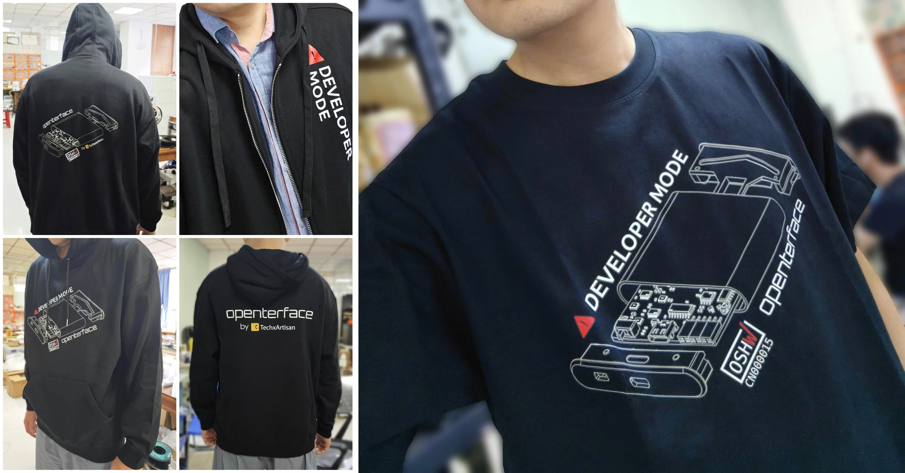

# La spedizione è partita! Cavi aggiuntivi inclusi nel Toolkit. E adesso?

Ciao, comunità di Openterface!

Siamo entusiasti di annunciare che i nostri prodotti Openterface sono stati ufficialmente spediti. Attualmente si trovano al porto di Shenzhen, pronti a salire su una nave cargo diretta negli Stati Uniti!

  

Ecco le ultime novità:

## Preparativi per la spedizione: controlli di qualità e imballaggio

Prima di imballare e spedire, abbiamo testato accuratamente ogni unità per garantire la massima qualità, come abbiamo menzionato in un aggiornamento precedente: [Sfida fai-da-te, premi fantastici e produzione quasi completata!](https://www.crowdsupply.com/techxartisan/openterface-mini-kvm/updates/diy-challenge-cool-prizes-and-production-nears-the-finish-line). Ogni cavo è stato sottoposto a verifiche di stabilità nella trasmissione del segnale utilizzando il nostro Mini-KVM.

Passiamo ora alle notizie – sia quelle negative che positive.

### Cattive notizie: Alcuni cavi arancioni non hanno soddisfatto le aspettative in condizioni difficili

Il nostro Mini-KVM trasmette video, audio, controllo di mouse/tastiera e dati USB tramite un unico cavo Type-C. La performance del cavo è cruciale per garantire la stabilità dei dati, specialmente in ambienti complessi.

Per simulare interferenze reali, abbiamo avvolto il cavo arancione Type-C attorno al motore di un ventilatore elettrico mentre diversi computer erano in funzione nelle vicinanze. Questo ha generato un alto livello di interferenze elettromagnetiche (EMI), permettendoci di valutare la stabilità nella trasmissione dei dati dei nostri cavi.

  
*Un metodo di test economico ma efficace.*

Guarda il nostro [video su Twitter](https://x.com/TechxArtisan/status/1856559677296816347) per vedere uno dei nostri test di performance a confronto.

In queste condizioni, alcuni cavi arancioni hanno mostrato perdite di segnale, sollevando preoccupazioni sulla loro affidabilità in ambienti complessi come data center o durante operazioni IT critiche.

Per affrontare il problema, Kevin Peng, il nostro direttore tecnico, ha sviluppato un programma di test su misura. Questo strumento, che ti permetterà di testare la qualità dei tuoi cavi USB, sarà presto reso open source con ulteriori aggiornamenti.

  
*Il nostro programma rende semplici i test dei cavi.*

Sebbene i nostri cavi arancioni, con la loro consistenza morbida e simile al silicone e l'aspetto accattivante, siano perfetti per l'uso quotidiano come la ricarica rapida e la trasmissione di dati standard, non sono adatti per lavori di trasmissione intensiva in condizioni difficili come EMI elevate.

### Buone notizie: Abbiamo una soluzione!

Abbiamo immediatamente procurato cavi USB 3.2 in nylon di alta qualità da includere come extra nella versione Toolkit, **senza alcun costo aggiuntivo**. Questi cavi resistenti sono disponibili in tre lunghezze, in colore grigio: *1 m (3,2 ft)*, *1,5 m (4,9 ft)* e *2 m (6,5 ft)*. Riceverai uno di questi cavi selezionato casualmente nella tua versione del Toolkit, garantendo una connessione affidabile e robusta per il tuo Mini-KVM.

Nelle future versioni del Mini-KVM Toolkit, il cavo arancione per il collegamento al lato host del Mini-KVM sarà sostituito dal cavo Type-C 3.2 in nylon, combinando funzionalità, stabilità e stile.

Speriamo che apprezzerai questa decisione e continuerai a fare affidamento su Openterface nei momenti critici in ambito tecnologico.

## Programma di spedizione

Quando puoi aspettarti il tuo Mini-KVM?  
Se tutto procede senza problemi, i nostri prodotti dovrebbero arrivare al **magazzino Mouser di Crowd Supply entro metà dicembre**. Successivamente, saranno spediti secondo gli ordini ricevuti.

- **Per i sostenitori negli Stati Uniti**: C'è una piccola possibilità di consegna prima di Natale, ma non è garantita, poiché tutto tende a rallentare con l'avvicinarsi delle festività.  
- **Per i sostenitori al di fuori degli Stati Uniti**: I tempi di consegna variano a seconda della regione. La nostra stima migliore è metà gennaio.

Speriamo in un viaggio senza intoppi per i nostri prodotti Openterface – senza mal di mare, mal d'auto o jet lag! 😃

## Fantastici T-shirt e felpe Openterface

Saremo alla Maker Faire di Shenzhen questo fine settimana (16–17 novembre). Per prepararci, abbiamo progettato abbigliamento per il team, inclusi T-shirt, felpe con zip e felpe classiche.

Dai un'occhiata e facci sapere cosa ne pensi:  

## Supporta il nostro sviluppo

Se vuoi supportare ulteriormente il nostro sviluppo open source, visita il nostro [TechxArtisan Shop](https://shop.techxartisan.com/). Puoi acquistare cavi, T-shirt e felpe, contribuendo a finanziare le nostre innovazioni. Ogni acquisto conta e sostiene lo spirito della comunità open source.

## Prossimi passi: Aggiornamenti dell'app host

Ora che la spedizione è in corso, ci concentreremo sul miglioramento delle nostre app host. Stiamo lavorando per certificarle nei vari store di applicazioni per garantire un'esperienza fluida con Openterface.

## Prossimi passi: Partecipa alla nostra sfida USB DIY

Perché non partecipare alla nostra **USB KVM DIY Challenge 2024** una volta che avrai ricevuto il tuo Mini-KVM Openterface? È un'ottima occasione per contribuire allo sviluppo open source e vincere premi, tra cui due Mini-KVM Openterface in edizione speciale e altro ancora! Per maggiori dettagli, visita la [pagina del concorso di Crowd Supply](https://www.crowdsupply.com/techxartisan/usb-kvm-diy-challenge-2024).

  

## Conclusione

Grazie per essere una parte integrante del nostro percorso. Il tuo supporto e i tuoi feedback ci spingono a continuare. Se hai domande o idee, saremo felici di sentirti! Unisciti alla conversazione nella nostra comunità su [Reddit](https://openterface.com/reddit) e [Discord](https://openterface.com/discord).

Con gratitudine,  
**Billy Wang**  
Product Manager  
Team Openterface | TechxArtisan
