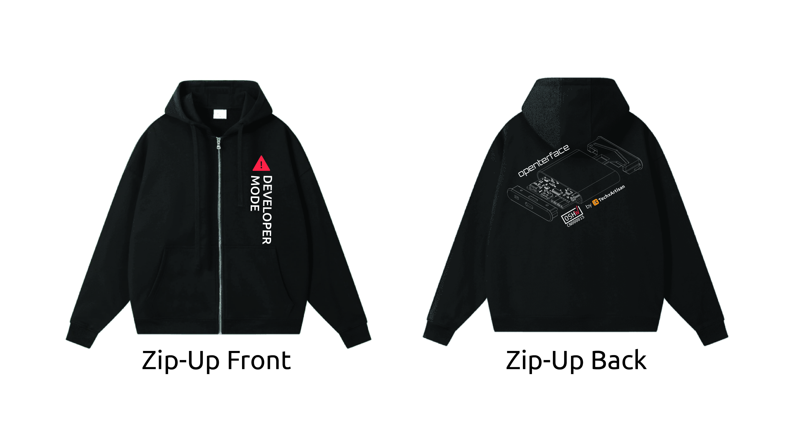

# 50% DI SCONTO su TUTTI gli Articoli – Solo per questo Black Friday! Mostra il tuo supporto per l'Open Source!

Cari amici di Openterface,

Abbiamo una notizia entusiasmante: abbiamo lanciato **una nuova linea di abbigliamento** su Openterface! La nostra collezione include T-shirt e felpe che incarnano lo spirito della nostra comunità. Non sono solo vestiti; sono una celebrazione dei nostri valori condivisi e dell'etica di Openterface.

Cosa rende questi design così speciali? Sia la T-shirt che la felpa presentano con orgoglio il **disegno tecnico del nostro mini-KVM Openterface**, che ha un aspetto incredibilmente cool. Inoltre, abbiamo messo in evidenza il testo **“Developer Mode”** del nostro mini-KVM nel design—un’idea che riteniamo assolutamente brillante. Indossando la nostra T-shirt o felpa, non è solo una questione di stare al caldo questo inverno; è un modo per entrare in modalità super sviluppatore per tutte le tue sessioni di coding e hacking.

E se ti stai chiedendo come appaiono nella vita reale, dai un'occhiata a come il nostro team li indossa in azione! Dallo stare comodi in **Developer Mode** durante il coding ([vedi tweet](https://x.com/TechxArtisan/status/1861611266705379346)), a un divertente photoshoot con David Groom di **MAKE: Magazine** al Shenzhen Maker Faire ([vedi foto](https://pbs.twimg.com/media/Gcp8E32agAAEnl-?format=jpg&name=large)), abbiamo mostrato con orgoglio il nostro abbigliamento. Ci siamo persino ispirati a una presentazione della leggenda Eric Migicovsky, famoso per Pebble ([vedi post](https://www.linkedin.com/posts/billy-wangrb_had-an-incredible-weekend-at-shenzhen-maker-activity-7264123680803233792-l7Mm?utm_source=share&utm_medium=member_desktop)), mentre dimostravamo il mini-KVM Openterface e ci connettevamo con amici tech ([vedi di più](https://twitter.com/TechxArtisan/status/1858397377196965913), [e qui](https://twitter.com/TechxArtisan/status/1858400923325726750)). Non sono solo vestiti: sono iniziatori di conversazioni e un modo per celebrare la nostra comunità ovunque andiamo!  

*Io e David non possiamo fare a meno delle nostre felpe—praticamente ci viviamo dentro!😉 Un enorme grazie a David per aver condiviso una foto così fantastica—veramente apprezzata!🎉*

E per questo inverno grigio, perché non dare una chance al nostro vivace cavo dati arancione? È un modo perfetto per ravvivare il tuo spazio di lavoro assicurando trasferimenti di dati veloci e affidabili.

Per rendere l'offerta ancora più dolce, stiamo offrendo uno <a href="https://shop.techxartisan.com" style="text-decoration: none;">🔥 SCONTO SPECIALE DEL 50% 🔥</a> su tutti gli articoli per i prossimi cinque giorni per questo **Black Friday 2024**, a partire dal momento in cui leggi questo messaggio fino al 1° dicembre. È il nostro modo per ringraziarti di essere parte del nostro viaggio.

Dai un'occhiata al nostro negozio qui: **[https://shop.techxartisan.com](https://shop.techxartisan.com)**. Scopri il nostro nuovo abbigliamento e accaparrati un pezzo a metà prezzo—non perdere questa offerta a tempo limitato!

### Merchandise di Openterface

### Accessori di Openterface

Grazie per essere con noi in questa avventura. Il tuo supporto significa tutto per noi, e siamo grati per ogni conversazione, idea e interazione che abbiamo avuto.

Cordiali saluti,  

**Billy Wang**  
Product Manager  
Openterface Team | TechxArtisan  

**P.S.** Hai pensieri o feedback? Siamo tutt'orecchi! Unisciti alla conversazione su [Reddit](https://openterface.com/reddit) o [Discord](https://openterface.com/discord), oppure sentiti libero di inviarci un'email a **info@techxartisan.com** ✉️.