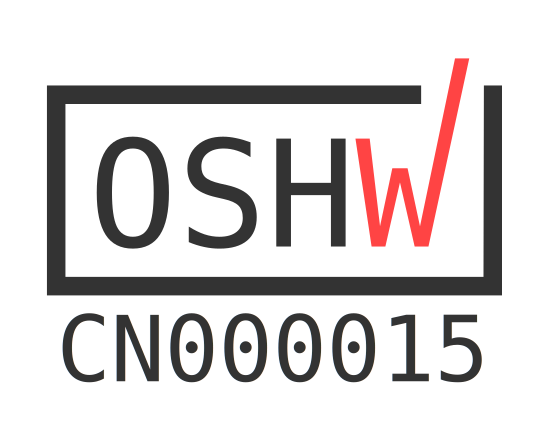

# Hardware Aperto

{:style="max-height:400px"}

## Esplora i Dettagli dell'Hardware

- [Openterface_Mini-KVM_Hardware](https://github.com/TechxArtisanStudio/Openterface_Mini-KVM_Hardware): Scopri il nostro design hardware completo, gli schemi e i componenti.
- [Pin di Estensione](pin.md): Impara come accedere e utilizzare i pin di estensione per lo sviluppo avanzato e la sperimentazione.

## Conformità OSHWA

{:style="height:120px"}
{:style="height:100px"}

Il nostro Openterface Mini-KVM è orgogliosamente certificato dalla **Open Source Hardware Association** (OSHWA). Questa certificazione OSHWA ([**UID CN000015**](https://certification.oshwa.org/cn000015.html)) conferma il nostro impegno verso i principi dell'hardware aperto, garantendo che tutti i file di design, la documentazione e il codice sorgente siano liberamente disponibili per studio, modifica, distribuzione e produzione.

## Unisciti al Divertimento dello Sviluppo

Siamo entusiasti di esplorare il potenziale del suo hardware e di questi pin di estensione, e ti invitiamo a unirti a noi in questa avventura! Mentre continuiamo a sviluppare e sperimentare, aggiorneremo questa sezione con maggiori informazioni su cosa possono fare questi pin e come possono essere utilizzati in modo creativo.

### Prossimamente
- Spiegazioni dettagliate sulla funzionalità dei pin
- Esempi di progetti fai-da-te che mostrano usi innovativi dei pin di estensione
- Idee e implementazioni contribuite dalla comunità

### Partecipa
1. **Condividi le Tue Idee**: Hai un'idea interessante per l'uso di questi pin? Ci piacerebbe sentirla!
2. **Contribuisci con Progetti Fai-da-Te**: Se hai creato qualcosa di interessante, considera di condividerlo con la comunità.
3. **Unisciti alla Discussione**: Connettiti con altri sviluppatori e appassionati per fare brainstorming e collaborare.

Rimani aggiornato e partecipa alle discussioni sullo sviluppo dei pin di estensione nella nostra [comunità Discord](/discord) o su [Reddit](/reddit).

La tua creatività e competenza possono aiutare a spingere i confini di ciò che è possibile con l'Openterface Mini-KVM. Innoviamo insieme!
