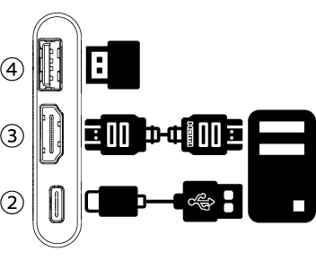

# Specifiche

## Panoramica

- Dimensioni: 61 x 13,5 x 53 mm / 2,40 x 0,53 x 2,09 pollici (Lunghezza x Larghezza x Altezza)
- Peso: 48g
- Rivestimento: Profilo in alluminio

## Interfacce

- ①  **Porta USB-C Host** (Femmina): Come porta dispositivo USB, collega al computer Host per il trasferimento dati tramite hub USB integrato
- ②  **Porta USB-C Target** (Femmina): Come porta dispositivo USB, collega al computer Host per emulare l'uscita HID di tastiera e mouse tramite hub USB integrato
- ③  **Porta di Input HDMI (Femmina)**: Ingresso sorgente HDMI dal computer Target
- ④  **Porta USB-A 2.0 commutabile (Femmina)**: Come porta host USB, utilizzata sia dal computer host che dal computer target in qualsiasi momento, ma non contemporaneamente
- ⑤  **Interruttore a levetta**: Per commutare la connessione della porta USB-A 2.0 tra il computer host e il computer target

## Alimentazione

- Tipo di Connessione: Alimentato tramite USB-C. Non è necessaria un'alimentazione esterna.

## Video

- Input Video Massimo: Fino a 3840x2160@30Hz, tramite HDMI (Nota: Con l'uso di un adattatore, può supportare anche VGA, Micro HDMI, DVI e altre sorgenti di ingresso video)
- Risoluzioni Video Supportate: Fino a 1920x1080@30Hz
- Metodi di Compressione Video: YUV, MJPEG
- Latenza: Inferiore a 140 millisecondi

## Audio

- Modalità di Acquisizione Audio: Audio HDMI incorporato

## Ambientale

- Temperatura di Funzionamento: 0°C a 40°C
- Temperatura di Stoccaggio: -10°C a 50°C
- Umidità: 80% RH
